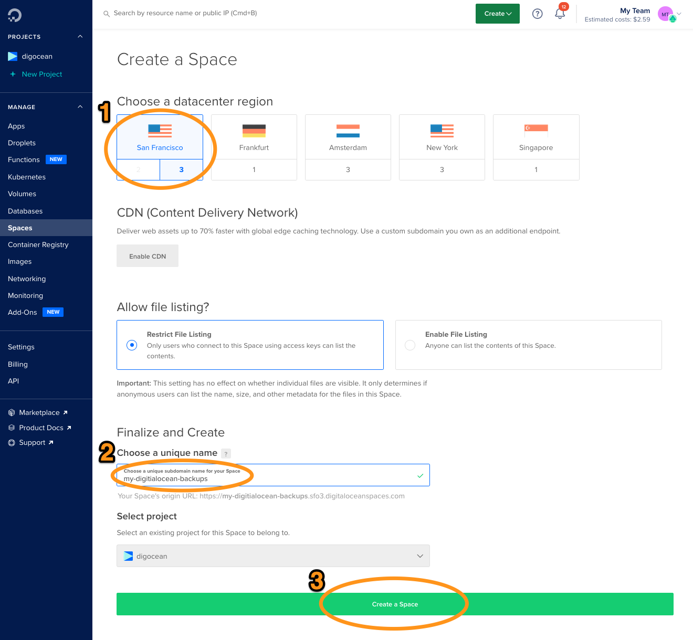
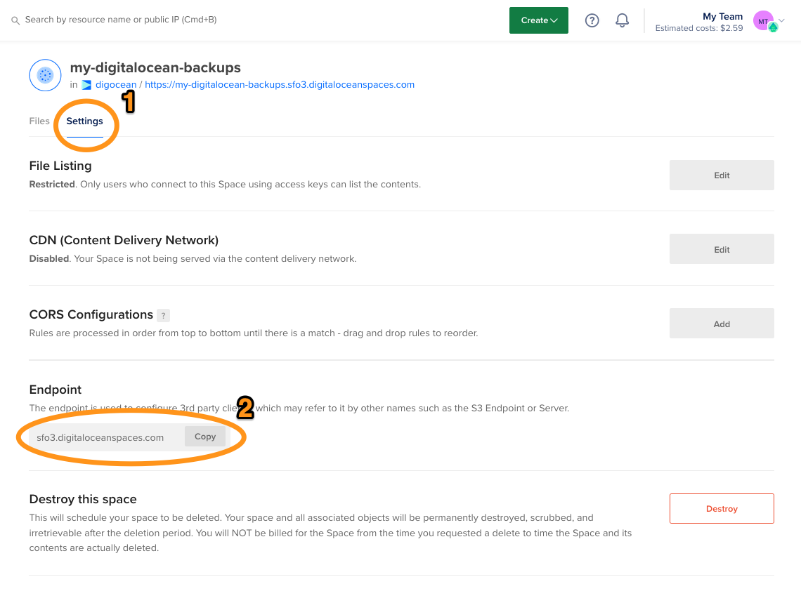
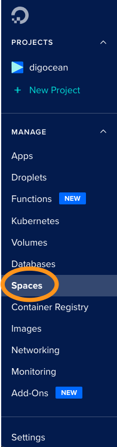
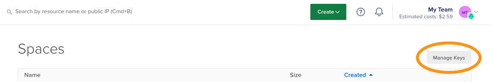
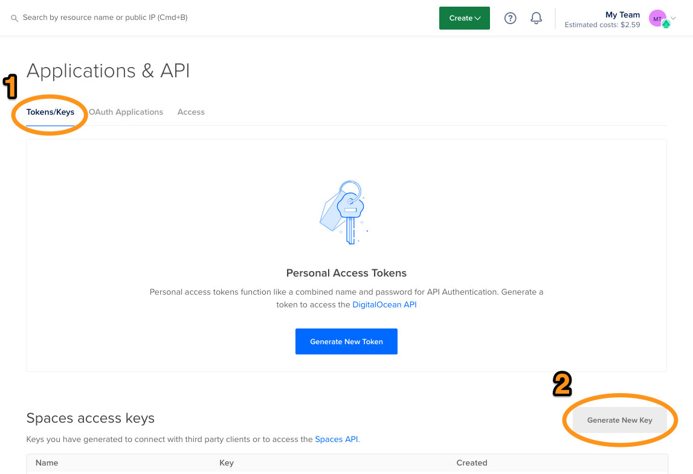
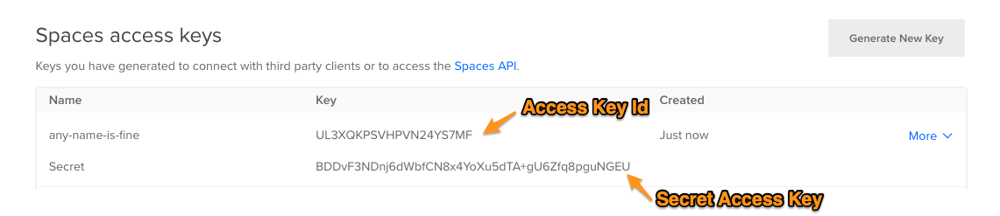

# Setting up Digital Ocean Spaces (S3)

Digital Ocean is probably the easiest S3-compatible object store to set up.  Steps to set up an S3 bucket on Digital Ocean are described below.

(This project is not affiliated with Digital Ocean.)

## 1. Create a Digital Ocean account

Digital Ocean is an easy-to-use cloud provider that offers an S3-compatible object store among other services.  You can sign up for an account [here](https://cloud.digitalocean.com/registrations/new).

## 2.  Create a new Space

Digital Ocean calls their S3 buckets _Spaces_.  To create one, log in to your account and navigate to `Create` -> `Spaces`.

Choose a region near you, give your bucket (Space) a name and click `Create`.  You'll need to enter this name in your config.

On the next page, go to settings and copy down the Endpoint URL.

You'll need to enter this in your config with a `:443` at the end.  Example:  `sfo3.digitaloceanspaces.com:443`

## 3.  Generate access credentials

You'll also need an Access Key Id and Secret Access Key for your Spaces account.  Click `Spaces` on the left hand bar.

Click the `Manage Keys` button at the top right:

And under `Tokens/Keys` click `Generate New Key`:

Enter any name for your key.  Your generated key will be shown:

Copy down both the Access Key Id and Secret Access Key to enter in your config.  Once you navigate away from this page, your secret will never be displayed again.

You now have 4 pieces of information that you'll need to enter into your config:

 - a bucket name
 - an Endpoint URL (don't forget to add `:443` at the end)
 - an Access Key Id
 - a Secret Access Key
 