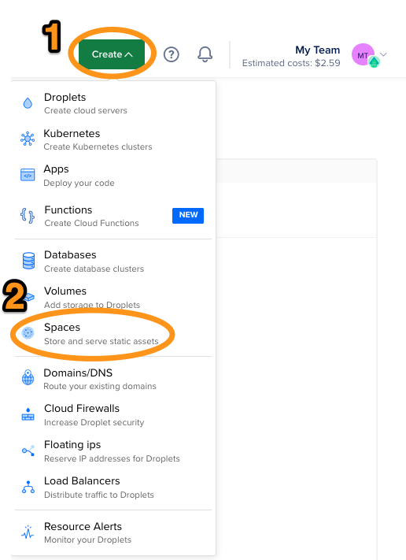

# Setting up Digital Ocean Spaces (S3)

Digital Ocean is probably the easiest S3-compatible object store to set up.  Steps to set up an S3 bucket on Digital Ocean are described below.

(This project is not affiliated with Digital Ocean.)

## 1. Create a Digital Ocean account

Digital Ocean is an easy-to-use cloud provider that offers an S3-compatible object store among other services.  You can sign up for an account [here](https://cloud.digitalocean.com/registrations/new).

## 2.  Create a new Space

Digital Ocean calls their S3 buckets _Spaces_.  To create one, log in to your account and navigate to `Create` -> `Spaces`.

